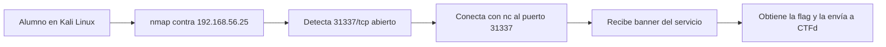

# Flujo del reto Puertas abiertas

## Explicación breve del flujo
El alumno no recibe el puerto como dato inicial. Primero enumera la superficie visible del host de laboratorio, detecta un puerto no estándar y luego usa una conexión manual para verificar qué entrega el servicio. La flag aparece como parte del banner del laboratorio controlado.
