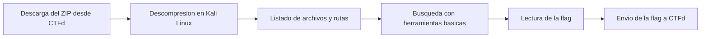

# Flujo del reto Comandos Linux - búsqueda básica

## Explicación breve
El reto guía al alumno por una secuencia simple pero importante: descargar, descomprimir, observar la estructura y buscar evidencia con comandos básicos. La resolución depende de la atención a la ruta y al contenido del archivo correcto.
